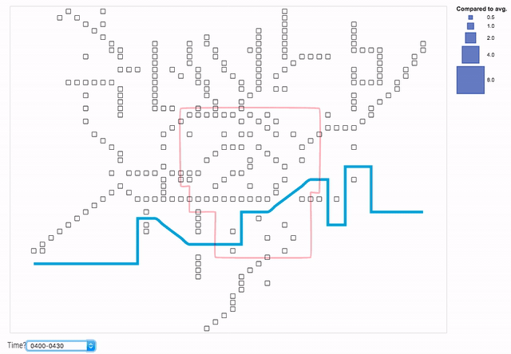

Lately, I have put more and more effort in trying to minimise the amount of carbon emissions produced by my daily commute. I became a long-distance cyclist and an intense user of the London underground, particularly in winter when the weather can be quite adverse (at least for Italians who are prone to be [‘hit by air’](https://www.bbc.com/news/magazine-15987082) ).

I find very challenging to travel on crowded trains / wait at tube stations at rush hours. I am used to plan the best route for my journey well in advance using TfL data. However, this usually requires a lot of time and cognitive effort. The reason for this is that there are more than 250 tube stations in London and passengers count data is provided at very small time intervals (i.e. 15 mins) and in absolute numbers. Thus, it can be burdensome to understand how busy each station is and to make comparison between stations or times. For instance, what does it mean to have 2,000 passengers at Baker street station at 6PM? Is it a lot? How does this compare with Great Portland Street?

The visualisations in this repo try to answer the following questions:
- What are the busiest times for each London underground station during weekdays? In particular:
- do individual stations show any pattern?
- how do stations compare to one another?

### References
[1] **Kindlmann, G. and Scheidegger, C.** (2014) An algebraic process for visualization design IEEE transactions on Visualization and Computer Braphics 20(12), pp.2181-2190

[2] **Smith, A.** (2019) Pictogram grid in d3js [Online]. [Available at http://bl.ocks.org/alansmithy/d832fc03f6e6a91e99f4] (Accessed 3 April 2019)

[3] **Kosara, R.** (2013) The isotype [Online]. [Available at https://eagereyes.org/techniques/isotype] (Accessed 3 April 2019)

[4] **BBC** (2010) London Underground Map [Online]. [Available at http://www.bbc.co.uk/london/travel/downloads/tube_map.html] (Accessed 6 March 2019)

[5] **Wood, J., Isenberg, P., Isenberg, T., Dykes, J., Boukhelifa, N. & Slingsby, A.** (2012). Sketchy rendering for information visualization. IEEE Transactions on Visualization and Computer Graphics, 18(12), pp. 2749-2758. doi: 10.1109/TVCG.2012.262

[6] **giCentre** (2017) Handy gallery [Online]. [Available at https://www.gicentre.net/handy/gallery/] (Accessed 3 April 2019)

[7] **Transport for London** (2016) Colour standard [Online]. [Available at http://content.tfl.gov.uk/tfl-colour-standards-issue04.pdf] (Accessed 10 April 2019)

### Data sources
**TfL** London Underground passenger counts data (En17week.csv, Ex17week.csv).
[Available at https://api-portal.tfl.gov.uk/docs]

**TfL** Busiest times on trains and in stations (LUTrainLoadingData.csv). [Available at http://crowding.data.tfl.gov.uk/]
